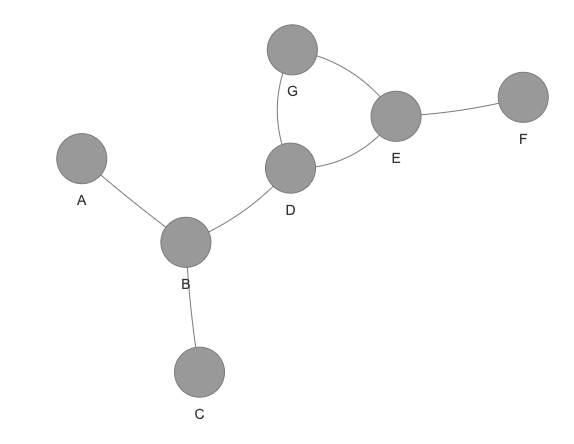
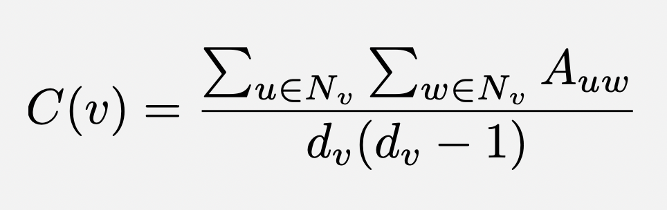
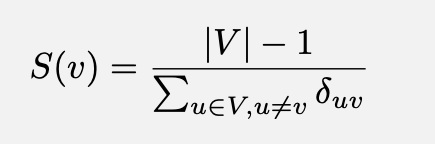
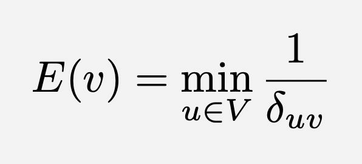

[](https://classroom.github.com/a/Fw5Kc0c0)
# Node Centralities on Animal Social Networks

**Learning Goals:** The goal of this assignment is to compare different node centralities and node-based measures on animal social networks. This assignment addresses [learning objectives 1, 2, and 3](https://reed-compbio-classes.github.io/bio331-F24-syllabus/doc/goals/):

- Represent biological systems as networks and understand how they are built from data.
- Implement graph algorithms and apply them to biological networks (including simulated and real-world datasets).
- Interpret the results of an algorithm run on a biological network.

**Criteria for Success:** There are five tasks in this assignment (Tasks A-F). If programming is familiar to you, I expect you to complete some of the optional challenges (labeled with an orange diamond :large_orange_diamond:). 

| Task | Pytests | Points | 
| -- | -- | -- |
| Task A: Read Files | 1 | 1 |
| Task B: Degree Centrality | 7 | 1 |
| Task C: Clustering Coefficient | 7 | 1 | 
| Task D: Closeness Centrality | 7 | 2 |
| Task E: Visualize Network | 0 | 2 |
| Task F: Compare Measures | 0 | 2 |
| Readable Code | 0 | 1 |
| **Total** | **22** | **10** | 

The "Readable Code" criterion means that your code is organized in a coherent way and you use comments throughout your code to explain any tricky parts. 

At any point you can type `pytest` in the terminal to see how many of the tests pass. These tests are located in a file with `test_` as a prefix, so you can see which examples pass and fail and debug your program.

**Resources:** Refer to the [the Python Resources on Moodle](https://moodle.reed.edu/mod/page/view.php?id=300747) page or the [Bio131 Python Crashcourse](https://reed-compbio-classes.github.io/python-crashcourse/) for Python syntax refreshers.  [PythonTutor](http://pythontutor.com/) can also help you with interactive debugging.

## :star: **Task A**: Read Animal Social Network and Node Information

For this assignment, you will choose one of the four animal social networks we read about in class. All networks are undirected, they are connected, and they contain no self-loops.

Before you start, make sure that you are in the `bio331-F24-P2-animal-centralities/` folder. You can `cd` (change directories) to this folder in the terminal. Ask me if you have questions about this. 

1. First, write a `read_edges()` function that takes a filename and returns a list edges (represented as **two-element lists**). There should not be duplicates in this list (e.g., `['A','B']` and `['B','A']`). Read the edges in the order they appear in the file.  
2. Then, write a `read_nodes()` function that takes a filename and returns one or more dictionaries that contain (node,annotation) pair, where the annotations denote different features of the nodes. You must parse at least one annotation for the network, though I would recomend parsing two for visualizing in Task E. Note that **all node files have a header that describes the annotations.**

:question: Don't know where to start? Take a look at the Files section and the Manipulating Strings section (Week 9) in the [python crashcourse website.](https://reed-compbio-classes.github.io/python-crashcourse/)

:bulb: You can copy any function from a previous lab or homework at any time - just be sure you cite where you copied it from in the comments. Also, note that when you copy code tabs get copied as spaces, which screws up Python indenting. When this happens, search for to consecutive spaces and replace those with tabs. 

:large_orange_diamond: if you are reading a network with weights and want to visualize edge thicknesses for weighted edges, consider writing a separate `read_weighted_edges()` function that returns a list of `[u,v,weight]` edges. You can turn a string into a number by explicitly telling Python to interpret it as a float: `float('1.45')`.

### Option 1: Badger Network (connected graph w/ a weighted option)

The badger social network is stored as two files in the `files/badger/` directory:

- `badger-edges.txt`: file of edges as `node1 node2 edge_weight`, where you can ignore the third column (unless you want to do a :large_orange_diamond:).
- `badger-nodes.txt`: file of four tab-delimited columns: `badger name`, `sex`, `infection status`, and `social group`.  The badger name is the same as the node name in the edges file.  This file also has a header.

:bulb: If you choose this network, you will write the following lines in the `main()` function:
```
edges = read_edges('files/badger/badger-edges.txt')
nodes = read_nodes('files/badger/badger-nodes.txt')
```

### Option 2: Dolphin Network (connected graph)

The dolphin is stored as six files in the `files/dolphin` directory:

- `files/dolphin/dolphin-edges.txt`: file of edges as `node1 node2`.
- `files/dolphin/females.txt`, `files/dolphin/males.txt`, `files/dolphin/unknown-sex.txt`: single-column lists of females, males, and dolphins whose sex is unknown.
- `files/dolphin/side-floppers.txt`: single-column list of side-flopping dolphins.
- `files/dolphin/upside-down-lobtailers.txt`: single-column list of upside-down lobtailing dolphins.

:bulb: If you choose this network, you will write the following lines in the `main()` function:
```
edges = read_edges('files/dolphin/dolphin-edges.txt')
nodes = read_nodes('files/dolphin/females.txt','files/dolphin/males.txt','files/dolphin/unknown-sex.txt','files/dolphin/side-floppers.txt','files/dolphin/upside-down-lobtailers.txt')
```
(you might decide to reorder the input files for the `read_nodes()` function or not use all of the information available; this is fine).

### Option 3: Dog network (w/ a weighted option)

There are two dog networks based on the two villages where most dogs were observed (Kakale and Magrao). Start by working with one of these networks; you can then use the same functions to process the second network. 

- `files/dog/kakale-edges.txt` and `files/dog/magrao-edges.txt`: file of edges as `node1 node2 contactTime`, where `contactTime` is the number of seconds that two dogs interacted (data collected over a mean of 8 days). You can ignore the third column (unless you want to do a :large_orange_diamond:).
- `files/dog/kakale-nodes.txt` and `files/dog/magrao-nodes.txt`: file of five tab-delimited columns: `DogID`,	`Village`,	`Sex`,	`AgeClass`, and body condition score `BCS`.  The DogID is the same as the node name in the edges files.  These files also have a header.

:bulb: If you choose this network, you will write the following lines in the `main()` function:
```
edges = read_edges('files/dog/kakale-edges.txt')
nodes = read_nodes('files/dog/kakale-nodes.txt')
```
or
```
edges = read_edges('files/dog/magrao-edges.txt')
nodes = read_nodes('files/dog/magrao-nodes.txt')
```

### Option 4: Zebra network

While the original paper describes two networks, I could only find one (available on [this website](https://networkrepository.com/mammalia-zebra-interaction.php)). I was able to find the unweighted nodes and the sex of each animal (unfortunately lactaction status is missing). However, this may still be interesting to calculate.

- `zebra-edges.txt`: tab-delimited file of edges as `node1 node2`.
- `zebra-nodes.txt`: tab-delimited two-column file of node and sex.

:bulb: If you choose this network, you will write the following lines in the `main()` function:
```
edges = read_edges('files/zebra/zebra-edges.txt')
nodes = read_nodes('files/zebra/zebra-nodes.txt')
```

### Check your code.

There is one pytest that checks the `read_edge()` function. Since the `read_node()` function differs according to the network you used, there are no pytests. The pytest for this section and (and the tests for all future sections) check a toy network located in `files/toy/toy-edges.txt`:



If any tests fail, read in this toy network for debugging.

## :star: **Task B**: Calculate the Degree Centrality of Every Node

Write a `calculate_degree()` function that takes an edgelist formatted according to Task A and returns a dictionary of (node, degree) pairs for every node in the graph. 

:bulb: Lab 1 might be useful code for this part. Be sure to "cite" any copied code in the comments.

There are 7 pytests for this task, one for each node in the toy network. 

## :star: **Task C**: Calculate the Clustering Coefficient of Every Node

Next, write a `calculate_clustering_coeff()` function that takes an edgelist formatted according to Task A and returns a dictionary of (node,clustering_coeff) pairs for every node in the graph. Let _d\_v_ be the degree of node `v`. The clustering coefficient _C(v)_ for a node _v_ is computed as



where _N\_v_ is the neighbors of _v_ and _A_ is the adjacency matrix.

:bulb: Remember that you are calculating the total number of edges among v's neighbors in the numerator. You do not need to build the adjacency matrix unless you want to (you can calculate this value another way). Refer to the math in Week 3's slides to make sure you don't double-count.

:question: What happens if a node has a single neighbor (a degree of one)? In that case, the denominator will be 0 so the equation is undefined. When a node has degree of one, then set the clustering coefficient to be 0.

There are 7 pytests for this task, one for each node in the toy network. 

## :star: **Task D**: Calculate the Closeness Centrality of Every Node

Write a `calculate_closeness()` function that takes an edgelist formatted according to Task A and returns a dictionary of (node,closeness_centrality) pairs.  Closeness centrality _S(v)_ for a node _v_ is computed as the reciprocal of the sum of the shortest paths of all nodes to _v_. We'll used the normalized version of the score, which multiples this term by the number of nodes minus one:



where _delta\_{uv}_ is the length of the shortest path from node _u_ to node _v_.

:bulb: Note that the distance of a node to itself will always be zero. You can ignore this case; otherwise you will get a `Divide by Zero` error.

:bulb: In general, if you have a disconnected network, you can ignore any case where the distance is infinity. (These networks are connected, so you won't run into this case in P2).

:bulb: L2 will have useful code for this part.

There are 7 pytests for this task, one for each node in the toy network. 

## :star: **Task E**: Visualize One of the Node Measures on the Animal Social Network

Write a `viz_graph()` function that takes an edgelist, the node annotations, and a dictionary of one of the node measures (degree centrality, clustering coefficient, or closeness centrality), and an HTML file name. The function writes an `html` file to visualize in a web browser. Your graph should have one annotation (e.g. sex) or two annotations (e.g., sex and TB status), and the nodes should be sized so larger nodes have higher node measure values. 

In addition to the node color, there are other ways to annotate nodes in `pyvis`. [Refer to the documentation here](https://pyvis.readthedocs.io/en/latest/documentation.html#pyvis.network.Network.add_node), especially the options to add a `color`, `size`, `shape`, `title`, and `borderWidth`.

Visualize a new network where the edge thickness corresponds to the edge weights. You can change line thicknesses with the `width` attribute in the [pyvis add_node function](https://pyvis.readthedocs.io/en/latest/documentation.html#pyvis.network.Network.add_edge).

:question: This function isn't yet in `run.py`! Define it in your code and be sure to call it from the `main()` function. 

:question: having trouble scaling the node sides to be viewable? I had issues too. Consider multiplying the measure by a constant factor, or taking the square of it, or doing something that also scales with the number of nodes. A subtle shift is OK as long as it's there.

There are no pytests for this part.

## :star: **Task F**: Compare the three node measures on the network.

Finally, compare the node measures in your network. For this, you will either need to print a table to the terminal or write the values to a file. In the comments (lines starting with `#`), write a description of this comparison. 

:bulb: You can choose to write a separate `compare()` function or write this code directly in the `main()` function.

:bulb: I encourage you to plot these values for each node in any way you'd like (a spreadsheet, in R, or in Python - see the first challenge below). This will help you get a broad sense of the relationships among these three measures.

There are no pytests for this part.

## Additional Challenges: 

If you complete Tasks A-F rather quickly, I expect you to attempt at least one of the challenges below. 

### :large_orange_diamond: Generate figures in python comparing node measures for a single network

Plot the degree, clustering coefficient, and the closeness centrality for every node using `matplotlib` functions (e.g., scatter plots, line plots, or bar plots). Take a look at L1 code, as well as [this matplotlib gallery](https://matplotlib.org/stable/gallery/index.html) with different visualization options.

### :large_orange_diamond: Implement Eccentricity Closeness

Write a `calculate_eccentricity()` function that calculates the eccentricity centrality _E(v)_ for every node _v_. Instead of the sum, take the _maximum_ shortest path from _v_ to any other node. Note that this corresponds to the _minimum_ reciprocal of this value.:



where _delta\_{uv}_ is the length of the shortest path from node _u_ to node _v_.

### :large_orange_diamond: Handle weighted edges

Some of the networks have a third weight column. Write a `dijkstra()` function that implements Dijkstra's algorithm for non-negative edge weights. See the slides from Week 3. 

When you run shortest paths on the weighted animal networks, you must log-transform the edge weights into costs (so lower is better). To do this, **first adjust your weights to be between 0 and 1** (e.g., by dividng all entries by the largest weight). Then, you can `import math.log` at the top of the file modify a weight `w` with the following:

```
w_transformed = - math.log(w)
```

You can also write `weighted_degree()` and `weighted_closeness()` functions that use the edge weights. (Note that clustering coefficient doesn't have a weighted version unless the weights have a specific range).

:question: what happens when the weight is exactly 1? Then the negative log is 0. This is not good because then the algorithm will not know which order to explore the nodes.

:question: what happens when the weight is exactly 0? Then the negative log is infinity. This is also not good - in this case set the value to to a very large number (but not infinity). 

### :large_orange_diamond: Generate networks for multiple animal social networks

Calculate node measures and visualize the networks for other animal social networks. There may not be direct comparisons to draw across animal social networks because the studies and methodologies are so different, but it would be very cool to see if there were any trends that were consistent.

If you have data for multiple networks, you can plot them using `matplotlib` functions.

## Submitting

:star2: **You're Done with Tasks A-F!** Commit and push your changes so they appear in your repositories in the [Reed Compbio Classes GitHub organization](https://github.com/Reed-Compbio-Classes/).

**Resubmission Instructions:** According to Bio331's [deadline policy](https://reed-compbio-classes.github.io/bio331-F24-syllabus/doc/policies/#deadline-policy), you can resubmit any programming or written assignment if you follow these guidelines:

- You must submit whatever work you have by the deadline.
- You must include a comment or statement saying you will resubmit this assignment.
- You must schedule a time to meet with me within one week of the deadline in order to make a plan. 

This is intended to be used if you cannot complete the work by the deadline. If you make a major misstep on an assignment, I will reach out to talk about resubmission options. You must submit all work by 5pm on the last day of finals. 
